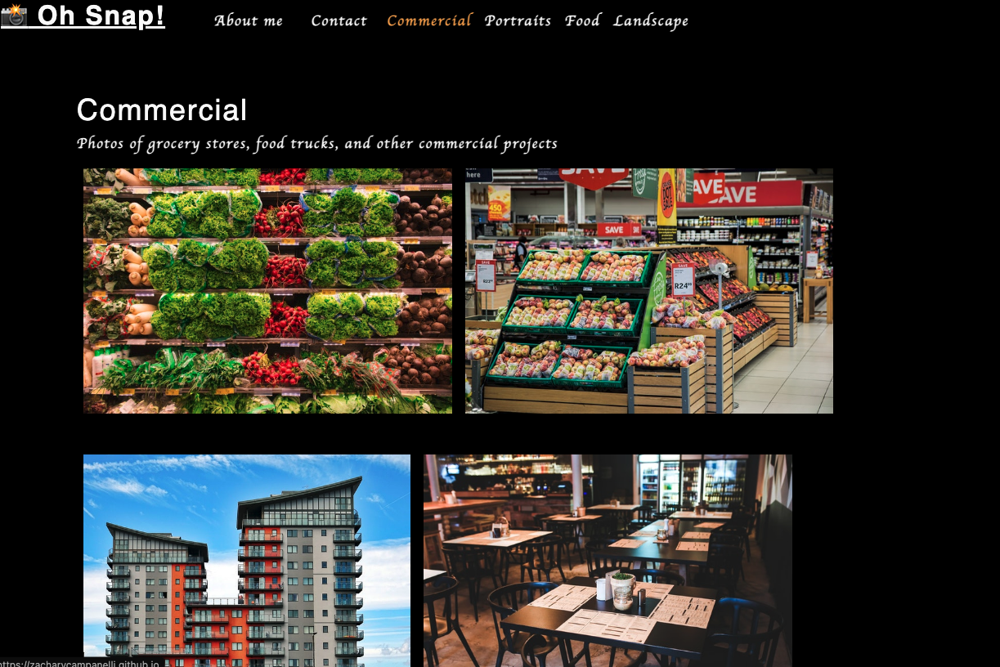
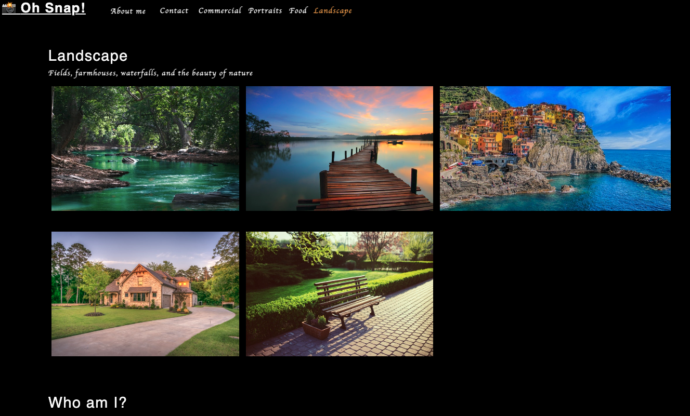
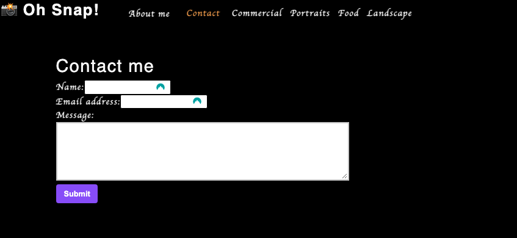

# React To These Photographs
  
## Description 

  
A single page application which is used to display a photographer's portfolio. This application is built using React, including React state, props, hooks, and UI components

## Table of Contents
* [Installation](#Installation)
* [Usage](#Usage)
* [License](#License)
* [Questions](#Questions)

## Installation
Clone this repository to your computer. Navigate to the root folder then run `npm init` or `npm init -y`. Then run either `npm i` or `npm install` to install the local dependencies

  
## Usage
Run the commmand `npm start` from the root folder of the application, then visit `localhost:3000/` from your browser. The link to the deployed website can also be used, located at the bottom of this page

  

## License
A short and simple permissive license with conditions only requiring preservation of copyright and license notices. Licensed works, modifications, and larger works may be distributed under different terms and without source code.  
  
## Questions
If you have any questions, concerns, or comments, feel free to contact me:
  
-GitHub: [Zacharycampanelli](https://github.com/Zacharycampanelli)  
-Email: [zaccamp@optonline.net](mailto:zaccamp@optonline.net)

## Link to Deployed Application
-[GitHub Pages](https://zacharycampanelli.github.io/react_to_these_photographs/)